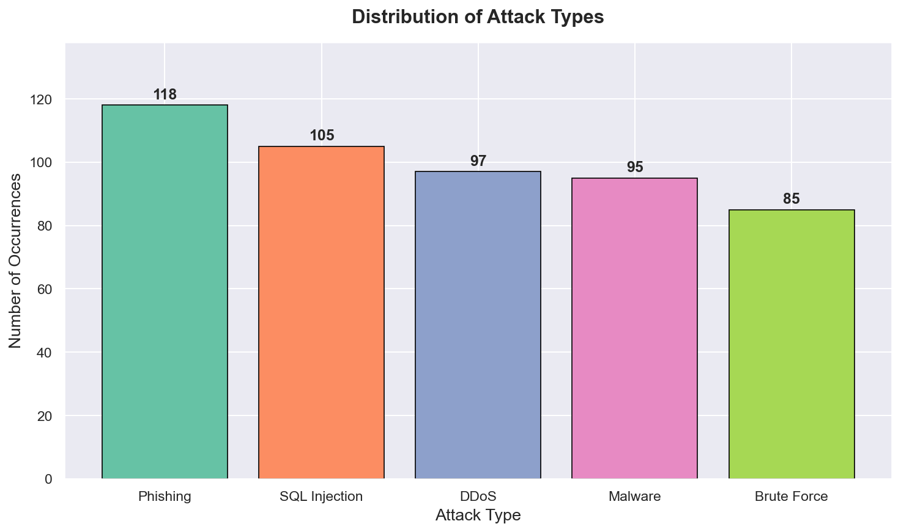
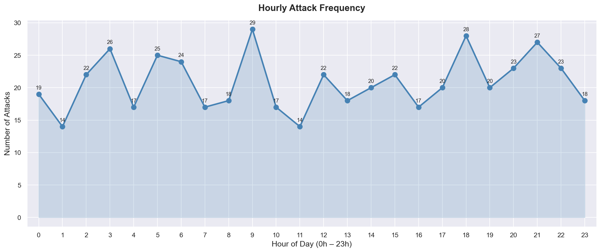
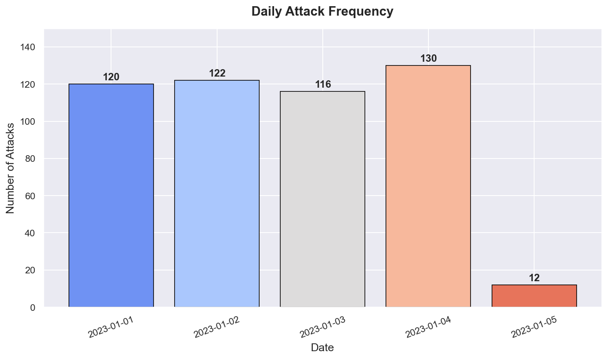
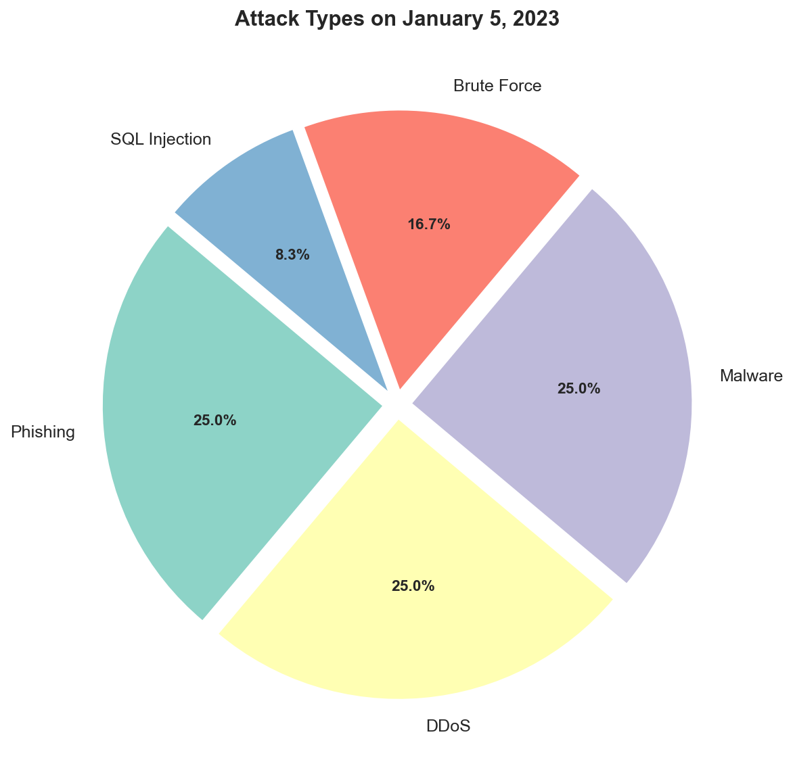
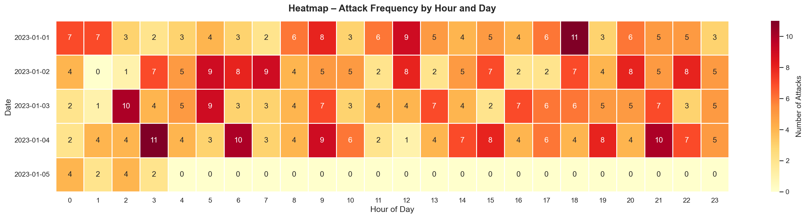
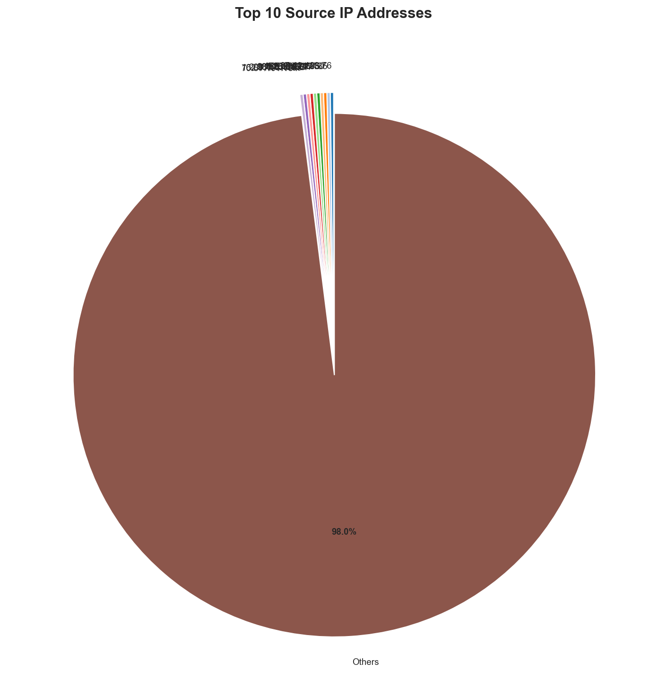
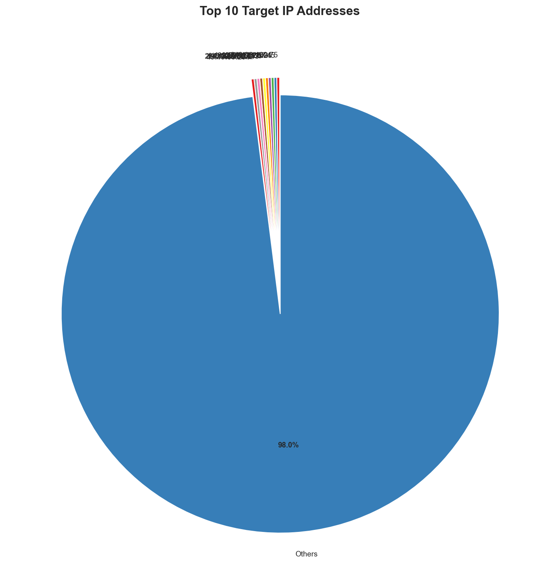
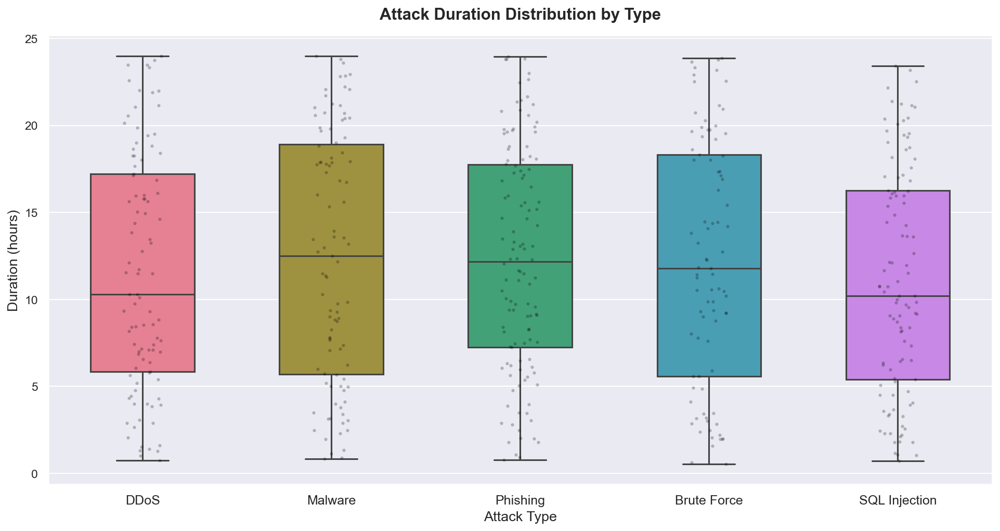

# 🛡️ Cybersecurity Attack Data Visualization

**A complete Python data visualization project** analyzing simulated cybersecurity attacks.  
This project is designed to be **educational** — every step is explained so that anyone learning data science can follow along, understand the code, and reproduce the results.

---

## 📖 What Is This Project About?

In this project, we work with a dataset of **500 cybersecurity attack records**. Each record tells us:
- **When** the attack happened
- **What type** of attack it was (DDoS, Phishing, Malware, etc.)
- **Where it came from** (Source IP)
- **Who was targeted** (Target IP)
- **How long it lasted** (in hours)

Our goal is to **explore and visualize** this data to answer real analytical questions — the same kind a security analyst would ask.

---

## 📁 Project Structure

```
📦 TP1/
├── 📓 TP_2_Visualisation_Final.ipynb   → Main Jupyter notebook (all questions + charts)
├── 📊 TP_12.csv                         → Dataset (500 attack records)
├── 🖼️  images/                           → All exported chart images
│   ├── q4_attack_types_bar.png
│   ├── q5_hourly_frequency.png
│   ├── q6_daily_frequency.png
│   ├── q7_pie_jan5.png
│   ├── q8_heatmap.png
│   ├── q9_source_ips.png
│   ├── q10_target_ips.png
│   └── q11_boxplots_duration.png
└── 📝 README.md                          → This file
```

---

## 📊 Dataset Overview

The file `TP_12.csv` contains **500 rows** and **5 columns**:

| Column | Type | Description |
|---|---|---|
| `Timestamp` | datetime | Exact date and hour the attack occurred |
| `SourceIP` | string | IP address of the attacker |
| `AttackType` | string | Type of cyberattack |
| `TargetIP` | string | IP address of the victim machine |
| `AttackDurationHours` | float | How long the attack lasted (in hours) |

**Attack types in the dataset:**

| Attack Type | Description |
|---|---|
| `DDoS` | Distributed Denial of Service — flood a server with traffic to make it crash |
| `Phishing` | Trick users into revealing credentials via fake websites or emails |
| `Malware` | Malicious software installed on the victim's machine |
| `SQL Injection` | Inject malicious SQL code into a database query |
| `Brute Force` | Try many passwords until the correct one is found |

---

## 🛠️ Libraries Used

```python
import pandas as pd        # Data loading and manipulation
import numpy as np         # Numerical operations
import matplotlib.pyplot as plt  # Base plotting library
import seaborn as sns      # Higher-level statistical visualization
```

> **Why these libraries?**
> - `pandas` lets us load the CSV and work with it like a spreadsheet in Python
> - `matplotlib` is the standard plotting library in Python — all charts are built on top of it
> - `seaborn` makes it very easy to produce beautiful statistical charts with minimal code

---

## 🔍 Questions & Visualizations — Step by Step

---

### ✅ Q1 — Display the First 10 Rows

```python
df.head(10)
```

> **Why?** Before analyzing anything, always look at your data first. This tells you what you're working with — the columns, their values, and the format.

---

### ✅ Q2 — Describe Columns and Their Types

```python
df.dtypes    # Shows the data type of each column
df.info()    # Shows non-null counts, memory usage
df.describe()  # Statistical summary of numeric columns
```

> **Why?** Knowing data types is essential. For example, `Timestamp` must be converted from a string to a datetime object before we can extract the hour or day from it. `describe()` gives you the min, max, mean, and quartiles for numeric columns.

---

### ✅ Q3 — Separate Numerical and Categorical Variables

```python
num_cols = df.select_dtypes(include=[np.number]).columns.tolist()
cat_cols = df.select_dtypes(include=['object', 'datetime64[ns]']).columns.tolist()
```

> **Why?** In data analysis, understanding the nature of each variable is fundamental:
> - **Numerical** variables can be averaged, summed, plotted on a number line
> - **Categorical** variables represent groups or labels — they are counted, not averaged
>
> In our dataset: `AttackDurationHours` is numerical, while `AttackType`, `SourceIP`, `TargetIP` are categorical.

---

### 📊 Q4 — Bar Chart: Distribution of Attack Types

> **Goal:** Understand how many attacks of each type exist in the dataset.

**What the chart shows:** Each bar represents one attack type. The height = how many times that attack was recorded.

```python
attack_counts = df['AttackType'].value_counts()
ax.bar(attack_counts.index, attack_counts.values)
```

> **Why a bar chart?** Bar charts are ideal for **comparing quantities across categories**. Here, we want to compare the frequency of each attack type at a glance.



---

### 📈 Q5 — Line Chart: Hourly Attack Frequency

> **Goal:** Identify which hours of the day have the most attacks.

**What the chart shows:** Each point on the line represents one hour (0h to 23h). The higher the point, the more attacks happened at that hour.

```python
hourly = df['Hour'].value_counts().sort_index()
ax.plot(hourly.index, hourly.values, marker='o')
ax.fill_between(hourly.index, hourly.values, alpha=0.2)
```

> **Why a line chart?** Line charts are perfect for showing **trends over time** (or ordered categories like hours). The filled area under the line helps visualize the volume more intuitively.



---

### 📊 Q6 — Bar Chart: Daily Attack Frequency

> **Goal:** See how attacks are distributed across different days.

**What the chart shows:** Each bar is one day. We can quickly spot whether attacks are concentrated on specific days or spread evenly.

```python
daily = df.groupby('DayStr').size()
ax.bar(daily.index, daily.values)
```

> **Why a bar chart again?** Because we're comparing a discrete quantity (number of attacks) across discrete categories (individual days). This is the classic use case for a bar chart.



---

### 🥧 Q7 — Pie Chart: Attack Types on January 5, 2023

> **Goal:** For a specific date, show what proportion of attacks were of each type.

**What the chart shows:** Each slice of the pie = one attack type. The bigger the slice, the more common that attack type was on that day.

```python
df_day = df[df['DayStr'] == '2023-01-05']
attack_day = df_day['AttackType'].value_counts()
ax.pie(attack_day.values, labels=attack_day.index, autopct='%1.1f%%')
```

> **Why a pie chart?** Pie charts are best for showing **proportions of a whole**. When we only care about the relative share of each category (not exact counts), a pie chart is very intuitive.



---

### 🌡️ Q8 — Heatmap: Attack Frequency by Hour and Day

> **Goal:** See at a glance which hour of which day had the most attacks — a 2D view.

**What the chart shows:** Each cell = (day, hour) pair. The color intensity = number of attacks. Dark red = many attacks, light yellow = few.

```python
hm_pivot = df.groupby(['DayStr', 'Hour']).size().unstack(fill_value=0)
sns.heatmap(hm_pivot, cmap='YlOrRd', annot=True)
```

> **Why a heatmap?** A heatmap is the best tool for visualizing a **two-dimensional frequency matrix**. It lets us spot patterns (e.g., "attacks tend to spike at certain hours on certain days") that would be impossible to see in a simple bar chart.



---

### 🥧 Q9 — Pie Chart: Top 10 Source IP Addresses

> **Goal:** Identify which attacker IP addresses are the most active.

**What the chart shows:** The top 10 most frequent source IPs, plus all remaining IPs grouped as "Others".

```python
src = df['SourceIP'].value_counts()
top_sources = src.head(10)
# Group the rest as 'Others'
labels = list(top_sources.index) + ['Others']
sizes  = list(top_sources.values) + [src.iloc[10:].sum()]
ax.pie(sizes, labels=labels, autopct='...')
```

> **Why Top 10 only?** There are nearly 500 unique IPs in the dataset — showing all of them in a pie chart would be unreadable. Grouping the rest as "Others" keeps the chart clean and meaningful.



---

### 🥧 Q10 — Pie Chart: Top 10 Target IP Addresses

> **Goal:** Identify which machines are attacked the most.

**What the chart shows:** Same approach as Q9, but for destination IPs (the victims).

```python
tgt = df['TargetIP'].value_counts()
# Same grouping logic as Q9...
```

> **Insight:** Comparing Q9 and Q10 together reveals whether attacks are concentrated (few sources targeting few victims) or distributed (many-to-many).



---

### 📦 Q11 — Boxplots: Attack Duration by Type

> **Goal:** Compare how long each type of attack typically lasts, and how variable the duration is.

**What the chart shows:**
- The **box** covers the middle 50% of durations (Q1 to Q3)
- The **line inside** the box = median duration
- The **whiskers** extend to the min/max (excluding outliers)
- **Red dots** = outliers (unusually long or short attacks)
- **Black dots** (overlaid) = all individual data points

```python
sns.boxplot(data=df, x='AttackType', y='AttackDurationHours', palette=palette)
sns.stripplot(data=df, x='AttackType', y='AttackDurationHours', color='black', alpha=0.25)
```

> **Why boxplots?** Boxplots are the best tool for comparing **distributions** across groups. Unlike a bar chart (which only shows the average), a boxplot shows you the spread, skew, and outliers — much richer information.

> **Why add a strip plot on top?** The strip plot overlays each individual data point on the boxplot. This prevents hiding the actual data behind the summary statistics — a best practice in modern data visualization.



---

## 🚀 How to Run This Project

### 1. Clone the repository

```bash
git clone https://github.com/farahktb/<repo-name>.git
cd <repo-name>
```

### 2. Install required libraries

```bash
pip install pandas numpy matplotlib seaborn jupyter
```

### 3. Open the notebook

```bash
jupyter notebook TP_2_Visualisation_Final.ipynb
```

> 💡 All outputs and charts are **already pre-rendered** in the notebook. You can view all results without running any code. Simply re-run the cells if you want to reproduce everything from scratch.

---

## 💡 Key Takeaways

| Topic | What You Learned |
|---|---|
| Data loading | How to load a CSV with `pandas` and parse dates |
| Data types | The difference between numerical and categorical variables |
| Bar charts | How to compare frequencies across categories |
| Line charts | How to visualize trends over ordered values (hours, days) |
| Pie charts | How to show proportions of a whole |
| Heatmaps | How to visualize a 2D frequency matrix with color |
| Boxplots | How to compare distributions across groups |

---

## 👤 Author

**MYC** · Data Science Student  
📅 March 2026

---

*This project is intended for educational purposes as part of a university Data Science practical lab.*
